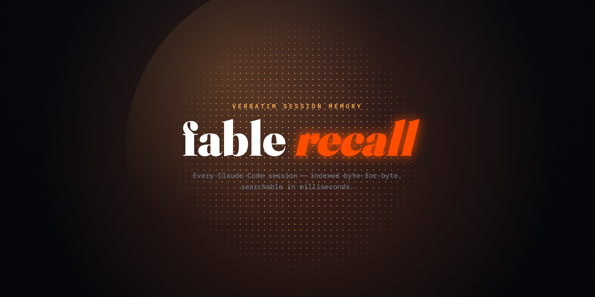
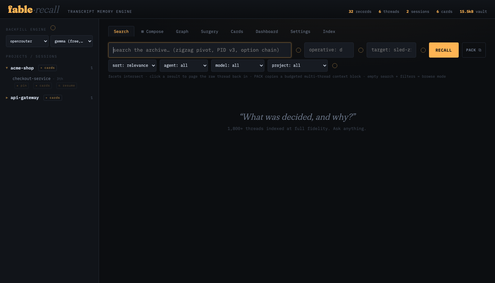
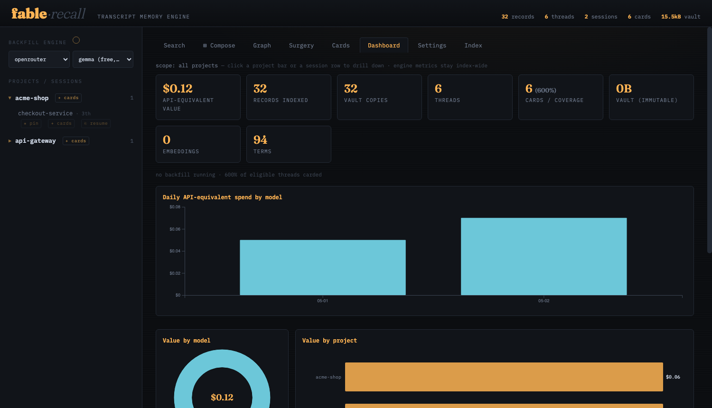
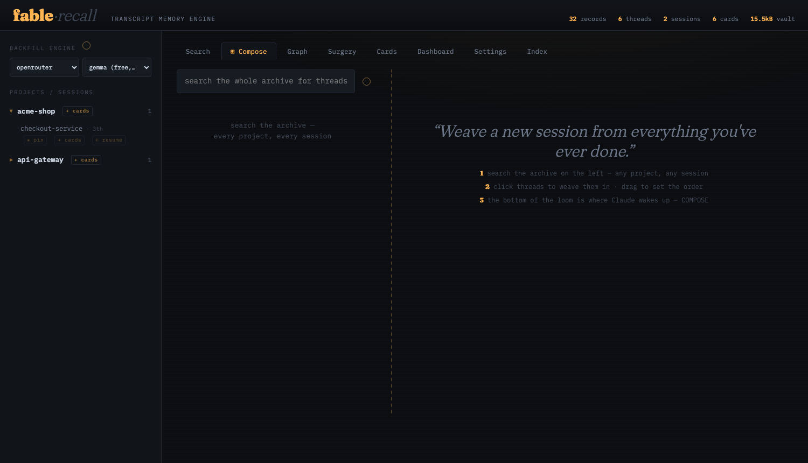

<div align="center">



# fable Recall

## Your Claude already has a memory. fable unlocks it.

[**Quickstart**](#fable-is-the-memory) · [**Why fable**](#why-fable--and-not-the-alternatives) · [**Benchmarks**](#how-it-works) · [**Roadmap**](ROADMAP.md) · [**Discussions**](../../discussions)

   

<table><tr>
<td width="50%"></td>
<td width="50%"></td>
</tr><tr>
<td colspan="2"></td>
</tr></table>

</div>

Every conversation you've ever had with Claude Code is already saved on
your machine — every decision, every debugging hunt, every 2 AM
breakthrough, word for word. **Claude just isn't allowed to use it.**

Mid-session, compaction builds a wall: everything behind it is locked away
to save tokens, and Claude carries on with a thin summary. `/clear` wipes
the slate. And after 30 days, Claude Code quietly **deletes the files
themselves**. Your project's real memory — locked, then destroyed, by
design.

Everyone else sells you a *replacement* memory: summaries, extracted
facts, vector stores. fable does something different — **it unlocks the
real one.**


```bash
pipx install git+https://github.com/grooverLab/fable
fable install       # one command: register the MCP, install hooks, index your history
fable serve         # browse your memory in a dashboard
```

100% local · no API keys · no cloud · no daemons. Your conversations
never leave your machine.

<details>
<summary><b>Setup &amp; commands</b></summary>

```bash
pipx install git+https://github.com/grooverLab/fable   # install the CLI
fable install        # one-shot: claude mcp add + Claude Code hooks +
                     # ~/.fable home + index every transcript
fable serve          # dashboard at http://127.0.0.1:8765
pipx upgrade fable-recall   # update later (pulls latest from GitHub)
```

`fable install` is idempotent — safe to re-run; it skips anything already wired.
To do it by hand: `fable setup` (home) · `claude mcp add fable -- fable mcp` (MCP) · `fable discover` (index).

| command | what it does |
|---|---|
| `fable search <q>` | rank threads by relevance (`--project`, `--kind`, `-n`) |
| `fable context <q>` | assemble a budgeted context pack |
| `fable thread <id>` | a thread's raw turns, byte-identical |
| `fable file <path>` | a file's full edit history across sessions |
| `fable cards run` | generate AI summary cards (background) |
| `fable discover` | (re)scan + index all Claude Code projects |
| `fable prune` · `fable export` · `fable stats` | slim a session · export · index stats |
| `fable serve` | the dashboard |

</details>

- **Ask about past conversations with Claude — get the real answer.**
  *"What did we decide about auth last month?"* Claude searches its own
  history mid-session (via MCP) and quotes the **actual transcript** —
  not a summary, not an extracted "fact." The conversation itself.
- **The wall stops costing you.** fable catalogs everything before
  compaction walls it off, and hands back exactly what Claude lost —
  on demand, under a token budget you set.
- **The 30-day deletion becomes irrelevant.** Sealed into a local vault,
  byte-identical, for as long as you decide.

## First of its kind — five things no other tool does

🧵 **Composed Sessions.** Hand-pick conversations from *any* project, any
month — put them in *your* order — and fable builds a brand-new session
that Claude resumes as its own lived history. A workspace with curated
memory. *(Empirically verified: restitched sessions resume cleanly,
signatures intact.)*

🕰️ **File time-travel.** Your transcripts accidentally versioned
everything. fable reconstructs **every file's edit history** — every Edit
and Write Claude ever made, across every session — with side-by-side
comparison between any two moments of a file's life, and a jump back to
the conversation that made each change. (`fable file src/loader.py`)

✂️ **Transcript Surgery.** Your 80 MB session is paying rent on dead
threads. Remove whole conversations — fable re-stitches the timeline,
shows you the simulation first, and keeps every removed byte recallable
forever. Reversible by construction.

🪶 **Pruning that loses nothing.** Slim every message (tool noise, images,
bloat) before resuming a heavy session — with an itemized preview of the
savings, and the original sealed in the vault first.

🔍 **Memory Diff.** See exactly what any prune or cleanup cost any
conversation — generation by generation, byte by byte. Nobody else can
even show you what was lost.

## How it works (the short version)

fable indexes your transcripts into a local SQLite archive: an immutable
**vault** (every byte, forever) plus a **search map** (keyword + semantic,
optional local embeddings via Ollama). Hooks run before Claude Code's
compaction and cleanup; an MCP server gives Claude search / recall /
remember tools. Measured on a real archive — 191,000 records, 6,000
conversations:

| recall@1 | recall@5 | search (p50) | full re-index |
|:---:|:---:|:---:|:---:|
| 76.7% | 90.0% | 135 ms | 6.6 s |

Reproduce it: `python3 scripts/benchmark.py`. No competitor publishes
retrieval numbers.

## Why fable — and not another memory layer

| | **fable** | claude-mem | mem0 / Letta | native Claude Code |
|---|:---:|:---:|:---:|:---:|
| Memory = your **actual conversations** | ✅ | ❌ summaries | ❌ fact snippets | ⚠️ locked behind the wall |
| Survives the 30-day deletion & `/clear` | ✅ | ⚠️ its summaries do | ❌ | ❌ |
| Claude searches its own history (MCP) | ✅ | ✅ | ❌ | ❌ |
| Composed sessions / file time-travel / surgery / diff | ✅ first of its kind | ❌ | ❌ | ❌ |
| Zero API keys, fully offline | ✅ | ✅ | ❌ | ✅ |
| Footprint | one SQLite file | Node + Chroma daemon | cloud / Docker | — |

(Fair is fair: mem0 fits multi-LLM production agents; ccusage goes deeper
on billing analytics. Different jobs, both compatible with fable.)

## Trusted the hard way

fable's first user is the session that built it: mid-build, that session
was pruned by fable (7.8 MB → 3.0 MB), kept working through compaction via
its own hook, and is now searchable through its own MCP server — and
`fable file fable/recall.py` replays its own source code being written,
18 versions deep. The build history eats its own dogfood — all $83k of
API-equivalent work in the author's archive included.

**What people use it for**
- *"Why did we choose X?"* — architecture archaeology, weeks later
- *"When did this function break?"* — file time-travel to the exact edit
  and the conversation around it
- Picking up a debugging hunt exactly where the wall cut it off
- A composed "workspace" session: threads from three projects, one memory
- Slimming a heavy session before `--resume`, reversibly
- `fable remember "we deploy Fridays only"` — standing rules, every session

Try it on a fictional sample first:
`python3 demo/seed_demo.py && fable --db demo/demo.db serve`


---

MIT · local-first forever ([non-goals](ROADMAP.md)) · built with Claude
Code, for Claude Code · `@claude` answers issues here — [the butler is
Claude](https://github.com/grooverLab/fable/issues/1) ·
[architecture deep-dive](docs/ARCHITECTURE.md) ·
[](https://star-history.com/#grooverLab/fable)
